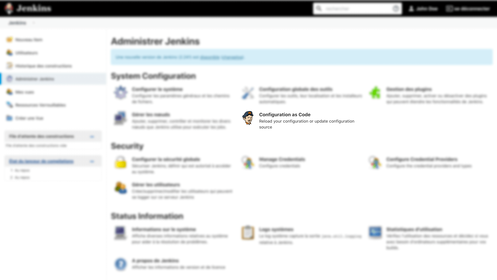

# Configuration as Code

# Installation
First, start a Jenkins instance and search for "Configuration as Code" plugin on plugin manager.
Official repository : https://plugins.jenkins.io/configuration-as-code/

> Note: this plugin is already installed in this showroom.

# Purpose
This plugin allow us to manage our Jenkins instance with code. No need to use interface to add SCM provider, user or credential.
This improve global reliability of our CI/CD solution.

# Create or load configuration
Configuration file is a YAML file. You have code samples at project root, folder "configuration".

## Jenkins configuration
Please add Jenkins related configuration at root of configuration folder.

## Jobs configuration
You can create subfolder in configuration folder. Operation `make configure` will copy all yml files, including thoses in subfolders.

# Load configuration
Please execute the following command at project root : 
```bash
make configure
```
This action will : 
- copy configuration file from "configuration" folder at project root to ./data/casc_configs
- restart Jenkins container. 

On administration panel, you'll see a result like this : 


If configuration is correctly loaded, you'll see :


# Reference
Reference can be display with the following URL : http://localhost/configuration-as-code/reference
