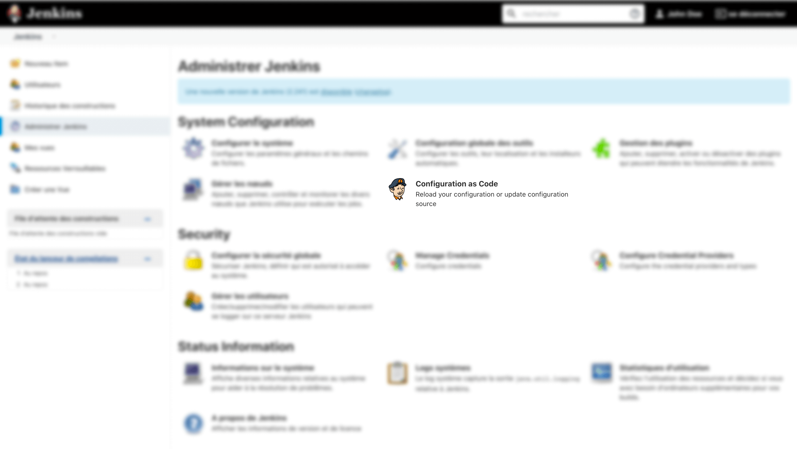
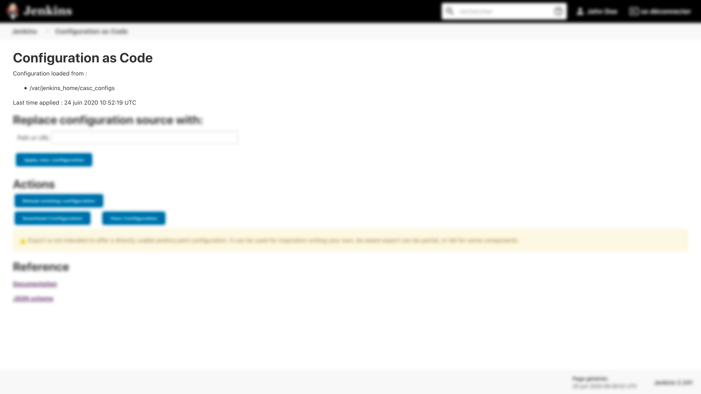

# Configuration as Code.

# Installation.
First, start a Jenkins instance and search for "Configuration as Code" plugin on plugin manager.

Official repository : https://plugins.jenkins.io/configuration-as-code/

# Create or load configuration.
Configuration file is a YAML file. You have a code sample at project root, folder "configuration".

# Load configuration.
Please execute the following command at project root : 
```bash
make configure
```
This action will copy configuration file

On administration panel, you'll see a result like this : 


If configuration is correctly loaded, you'll see :


# Reference
Reference can be display with the following URL : http://localhost/configuration-as-code/reference
