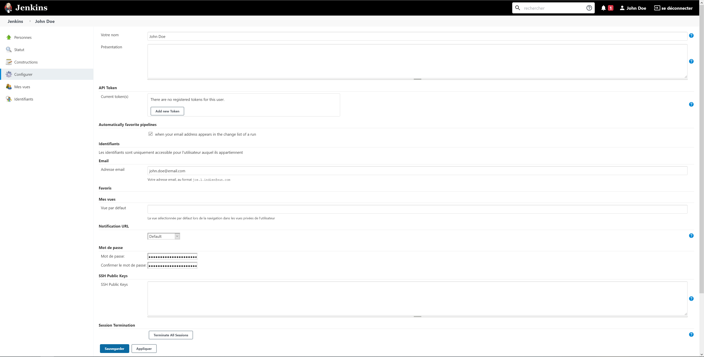

# Jenkins CLI
Jenkins CLI allow administrators to perform management actions in headless mode (without UI) and automated it.
This documentation explain how to manage your Jenkins with CLI, using the CLI client. Other methods are available, feel free to test it : https://www.jenkins.io/doc/book/managing/cli/ 

## How to get Jenkins CLI client
Please log in to Jenkins in your broswer, and visit http://localhost/cli/
You can see on the top of the page a link to download the latest client version : http://localhost/jnlpJars/jenkins-cli.jar

You can download it at the projet root, it will be not commited (disabled in .gitignore file) : 
```bash
curl "http://localhost/jnlpJars/jenkins-cli.jar" --output jenkins-cli.jar
```

## Configuration

### Jenkins
SSH server is disable by default on Jenkins. Please go to http://localhost/configureSecurity/ and in "SSH Server" block, set "8081" and save.
> Please note this configuration is activated on this showroom with configuration as code (configuration/security.yml)

### User
A Jenkins user must be configured to logged in Jenkins with CLI. Please access http://localhost/securityRealm/ and create a user or modify one.

For example my user is named "John Doe", with user ID "jdoe". On the user management page, please note field "SSH public keys"


Copy / past your public key in this field and save.

Let's perform a quick test to validate connection with CLI : 

```bash
# This command display the name of user that use CLI.
java -jar jenkins-cli.jar -s http://localhost -ssh -user jdoe who-am-i
```

> Do not specify port in URL

## Usage

### Disable a specific job

Documentation : http://localhost/cli/command/disable-job

```bash
java -jar jenkins-cli.jar -s http://localhost -ssh -user jdoe disable-job guardian-frontend/master
```

### Quiet down

Quiet down Jenkins, in preparation for a restart. Don’t start any builds.
Documentation : http://localhost/cli/command/quiet-down

```bash
java -jar jenkins-cli.jar -s http://localhost -ssh -user jdoe quiet-down
```

## Links
* Jenkins CLI documentation : https://www.jenkins.io/doc/book/managing/cli/
* Jenkins CLI API reference : http://localhost/cli